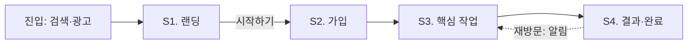
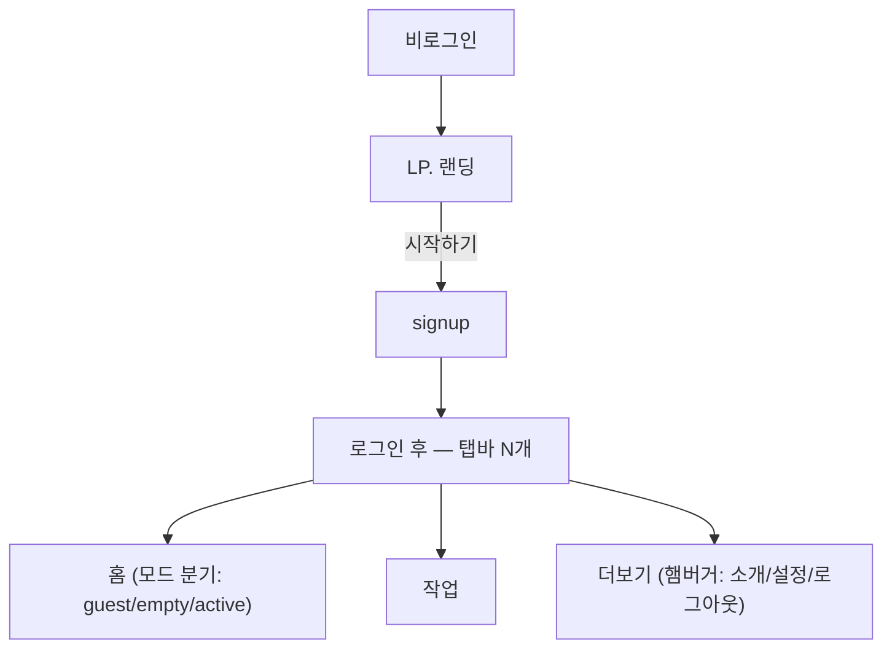

ScreenDesign는 이 스킬의 **무게중심**이다. 예전엔 아이디어를 실제로 작동하는 화면으로 만드는 것 자체가 비쌌다 — 코드를 짜든 화면을 그리든 사람 손이 많이 들었다. AI 빌더 시대엔 명세만 정확하면 그대로 구현(빌드)하는 일은 점점 쉬워진다. 그래서 좋은 아이디어는 오히려 점점 더 중요해진다 — 다만 (앞 단계에서 사업 타당성을 확보한) 그 아이디어를 실제로 구현하려면, *AI가 오해 없이 그대로 만들 수 있을 만큼 정확한 명세*가 있어야 한다. ScreenDesign가 바로 그 명세를 만드는 단계다.

**이 단계의 산출물은 `screen-design.md` 1개다.** 성격은 *behavioral brief* — 사용자가 무엇을 해내야 하고 화면이 어떻게 반응해야 하는지를 AI가 읽기 좋게 쓴 문서. 시각은 담지 않는다. **무엇으로 구성되는지의 단일 정의는 §4.1 템플릿** — 이 문서의 다른 곳에서 구성을 다시 나열하지 않는다.

다음 4단계(Prototype)에서 Claude Design이 이 명세 그대로 실제로 작동하는 화면(standalone.html)을 만들어 온다. 그 전에 손으로 임시 화면을 짜서 클릭 검증하는 중간 단계는 없다 — 빈틈(끊긴 전환·누락 화면)은 시나리오 경로 추적(§2.6)으로 *텍스트 상에서* 잡는다. 시각·클릭 검증은 Prototype 단계 몫.

**카피 톤**: 화면 카피·상태 문구는 market-research §최종 서비스 기획 요약 내용의 *최종 아이디어*가 풍기는 톤 + `ux-writing-reviewer` 에이전트의 토스 메커닉을 따른다 (§6.1). 별도 brand 문서는 없다 — 시각·디자인 시스템은 다음 단계 Claude Design이 생성.

**목차**
- §1 단계 목표 · SoT 책임
- §2 진행 절차
  - §2.1 단계 시작
  - §2.2 Step 1. 플로우 골격
  - §2.3 Step 2. 화면 명세(7요소) + 범위 경계 3단
  - §2.4 Step 3. IA·내비 구조
  - §2.5 Step 4. 샘플 데이터
  - §2.6 Step 5. 시나리오 + 수용 기준 (= 정합성 최종 검증)
- §3 완료 체크리스트
  - §3.1 핸드오프
- §4 산출물 스펙
  - §4.1 screen-design.md 템플릿 (형식의 단일 정의)
- §5 좋은/나쁜 예 + 재사용 패턴
  - §5.3 재사용 패턴 A~E
- §6 응대 톤·코칭
  - §6.1 ux-writing-reviewer

## 1. 단계 목표

이 단계의 목표는 **§4.1 템플릿의 모든 섹션이 채워지고 서로 정합적인 `screen-design.md`를 완성하는 것**이다 — 플로우·IA에 등장하는 화면 중 명세 안 된 것 0, 끊긴 전환 0, 경계 판정 안 된 기능 0, 수용 기준 없는 시나리오 0. 시각 완성도는 이 단계의 목표가 아니다 (다음 단계 몫). 목표를 이뤘는지는 §3 완료 체크리스트로 판정한다.

**SoT 책임** (SKILL.md §2.1): 시나리오 · 플로우 · IA·내비 구조 · 화면 간 전환 · 화면별 IA 요소·내용·행동·상태(빈·로딩·에러)·데이터. Prototype·MVP 문서엔 이 정보를 중복해 박지 않고 screen-design 참조로 redirect.

## 2. 진행 절차

### 2.1 단계 시작 — 이전 정리 내용을 보여주고, 이번 단계가 할 일을 안내한다

이 단계에 들어오면 가장 먼저 사용자와 "지금까지 어디까지 왔고, 이제 무엇을 할지"를 맞춘다. 순서대로:

1. **이전 단계까지 정리된 내용을 먼저 보여준다.** `market-research.md`의 §최종 서비스 기획 요약 내용에서 최종 아이디어·비목표·검증 가설을 짧게 요약해 사용자에게 다시 보여준다 — "여기까지가 우리가 확정한 내용이지?"를 함께 확인하는 것.
2. **그 내용을 기반으로 이번 단계가 무엇을 하는지 설명한다.** 확정된 아이디어를 화면과 흐름으로 구체화해서, 다음 단계의 Claude Design이 추측 없이 그대로 디자인할 수 있는 명세(`screen-design.md`)를 만드는 단계라고 안내한다. 이때 비목표는 "안 만들 화면"을 정하는 근거가 된다 (§2.3 범위 경계의 🚫 판정 근거).
3. **`screen-design.md` 머리에 `# 이전 결론 → 이번 결론` 섹션을 적는다** (SKILL.md §2.2). 이전 단계까지 정리된 내용이 이 단계의 출발점임을 문서에 남기는 것이다:
   - 이전 내용과 달라진 게 없으면 한 줄이면 된다: `변경 없음 — market-research.md §최종 서비스 기획 요약 내용 그대로`
   - 달라진 게 있으면 4개(최종 아이디어·비목표·검증 가설·북극성)를 전부 다시 쓰고, `## 변경`에 무엇이 왜 바뀌었는지 적는다.
   - 진행 중에 방향이 바뀌어도 `market-research.md`를 고치지 않는다 — 이 `이전 결론 → 이번 결론` 섹션을 갱신한다.

그 외 시작 시 확인할 것:

- 옛 단계 내용을 근거로 가져올 때는 SKILL.md §2.2 검토 절차(확인 질문 4개 + 표시)를 거친다.
- `screen-design.md`가 이미 있으면(스킬 중간 재실행 등) 읽고 §3 체크리스트로 검증해 부족한 부분만 보완한다.

### 2.2 Step 1. 전체 플로우 골격

`market-research.md`의 **최종 아이디어**를 사용자에게 다시 보여주고 묻는다:

```
확정한 아이디어가 [최종 아이디어 한 문단]였지. 그 사람이 이걸 처음 만나서
끝까지 쓰는 동안 어떤 순서로 뭘 하는지 골격부터 그려보자.

- 시작점: 어디서 알고 들어와? (진입)
- 처음 5분 안에 뭘 해?
- 핵심 작업이 뭐야? (목적 달성하는 그 순간)
- 끝낼 때 뭘 가지고 나가?
- 다시 돌아와서 또 쓰는 시나리오가 있어?
```

답을 받아 **Mermaid flowchart**로 정리해(형식은 §4.1) **사용자 확인 1회** — 여기까지 인터뷰 모드(배치 질문, SKILL.md §1.5), 이 골격 확인이 초안 완주 전 마지막 checkpoint다. **이후 Step 2~5는 초안 모드** — 한 호흡에 완주하고 리뷰는 §3 체크리스트 통과 시점에 한 번에 받는다. 불확실 지점은 에스컬레이션 기준 해당 시에만 배치 질문, 그 외엔 합리적 가정 + `추후 결정:` 마킹 후 계속.

**왜 Mermaid인가** — 이 문서의 1차 독자는 Claude Design(AI)이다. LLM은 ASCII 트리·산문보다 Mermaid를 오독이 적고 토큰 효율적으로 읽는다. 사람도 GitHub·에디터 미리보기에서 그림으로 렌더돼 읽기 편하다. 플로우·사이트맵 다이어그램 전부 적용.

### 2.3 Step 2. 화면 빠짐없이 나열 + 각 화면 명세 + 범위 경계 3단

플로우 골격에서 **등장하는 화면을 하나도 빠뜨리지 않고** 끌어내, 화면마다 **7요소**를 *전부* 채운다 (하나라도 비면 Prototype에서 추측이 생긴다):

1. **IA 요소** — 탭바 유무·활성 탭 / hero 종류(marketing·압축·없음) / CTA 패턴(인라인·하단 floating·sticky·없음 — 상태 따라 바뀌면 §5.3.E) / layout 분기(상태별 영역 변형 — §5.3.B) / MVP 마스크 영역(있으면 명시)
2. **진입조건** — 어디서 어떤 행동으로 이 화면에 오나
3. **보이는 것** — 주요 요소·콘텐츠. *실제 카피·데이터 필드*까지 (placeholder라도 구체값)
4. **가능한 행동** — 버튼·입력·제스처 각각, 그리고 *각 행동의 결과*(다음 화면 또는 상태 전환)
5. **상태** — 빈 / 로딩 / 에러 / 완료 중 이 화면에 해당하는 것 (없으면 "해당 없음" 명시)
6. **데이터** — 들어오는 필드 / 나가는 필드 (실물 값은 §2.5 샘플 데이터에)
7. **전환** — 이 화면에서 갈 수 있는 모든 다음 화면 (끊긴 곳 없게)

**범위 경계 3단 (강제)** — 화면 명세가 한 바퀴 돌면, 논의에 등장한 모든 화면·기능을 셋 중 하나로 판정해 표로 박는다(형식은 §4.1). **AI는 생략에서 추론하지 못한다** — "안 만든다"를 안 적으면 Claude Design·MvpBuild가 알아서 만들어버린다.

| 경계 | 뜻 |
|---|---|
| ✅ **작동** | 이번 프로토타입에서 클릭하면 실제로 동작 (mock data 기반) |
| 🟡 **화면만** | 화면은 보이되 동작 안 함 — MVP 마스크 처리 (§5.3.A) |
| 🚫 **없음** | 화면조차 만들지 않음 — market-research §비목표 사유 필수 |

### 2.4 Step 3. IA·내비 구조 설계

화면 명세가 정리되면 *화면 간 구조* 4개를 박는다 (형식·예시는 §4.1):

1. **사이트맵 다이어그램** — 진입~로그인 후~상태별 분기까지 한 장, Mermaid로.
2. **내비 컴포넌트 결정** — 탭바(노출 여부·탭 개수·진입 대상) / 햄버거 메뉴(그룹별 항목) / 헤더·뒤로가기(어느 화면에 [←]) / 하단 floating CTA(노출 화면·라벨).
3. **진입 분기 매트릭스** — 비로그인 / 로그인(상태별) × 상단·본문·탭바·CTA 표.
4. **한 화면 다 모드 검토** (§5.3.B) — *단일 URL + 콘텐츠 자동 분기*가 사용자 상태 다양성 흡수에 유리할지. 분리 vs 통합 결정.

### 2.5 Step 4. 샘플 데이터 — 첫 베타 케이스 한 명

화면별 "데이터" 항목(7요소의 6번)은 필드 *이름*만 담는다. 그 필드들의 **실물 값**을 `# 샘플 데이터` 섹션에 **한 블록으로** 모은다 — market-research 최종 서비스 기획 요약의 첫 베타 케이스(가장 구체적인 타겟 한 명)를 그대로 데이터로 옮긴 것 (형식은 §4.1).

**왜 한 블록인가** — 화면마다 흩어진 필드만 주면 Claude Design이 화면별로 제각각 mock 값을 지어내서, 프로토타입 안에서 S1의 사용자와 S3의 사용자가 다른 사람이 된다. 한 명의 일관된 데이터를 주면 전 화면이 같은 스토리로 이어져 *사용자 테스트(ProtoRetro) 때 데모가 실제 사용처럼 읽힌다*. 형식은 JSON 비슷하게 — 정확한 문법일 필요 없고 AI가 오해 없이 읽을 구체값이면 충분.

### 2.6 Step 5. 핵심 시나리오 + 수용 기준 (= 정합성 최종 검증)

가장 중요한 시나리오 3~5개를 User Story 형식으로 고르고, 각각 **어느 화면들을 지나가는지 경로**를 붙인다: `"[누구]로서 [무엇]을 [왜]하고 싶다 — 지나는 화면: S1→S3→S5"`.

이 Step이 **명세 전체의 정합성 검증을 겸한다** — 시나리오 경로를 화면 명세 위에 얹어보면 빈틈이 드러난다: 지나갈 화면이 명세에 없으면 Step 2로, 전환이 끊겼으면 해당 화면의 7요소 보강. 끊긴 전환·누락 화면 0이 될 때까지.

**수용 기준 (시나리오당 최대 3개, 강제)** — 각 시나리오에 "이게 충족되면 제대로 구현된 것"을 판정할 검증 문장을 붙인다. 형식은 EARS식:

```
WHEN [사용자 행동/조건] THEN [화면에서 벌어지는 일]
```

**왜 필요한가** — 이 하네스는 프로토타입 수정 루프가 없다(4-prototype.md §2.2). Claude Design이 한 번에 제대로 만들어 와야 하고, 받은 파일이 "제대로"인지는 4단계 체크리스트에서 판정한다. 수용 기준이 없으면 그 판정이 주관("괜찮아 보이네")이 되고, 있으면 기계적 체크가 된다. **최대 3개 제한은 세리머니 방지** — 시나리오의 급소만 찍는다. 화면 디테일은 7요소 명세가 담당하므로 중복해 적지 않는다.

## 3. 완료 체크리스트

다음이 모두 충족되어야 다음 단계(Prototype)로 진입. (§4.1 템플릿 섹션과 1:1 대응)

- [ ] **이전 결론 → 이번 결론** — `변경 없음` 한 줄 또는 `## 이전 결론`·`## 이번 결론`·`## 무엇이 왜 바뀌었나` (SKILL.md §2.2).
- [ ] **사용자 플로우** — 진입~재방문까지 Mermaid flowchart로.
- [ ] **사이트맵·IA** — 사이트맵 다이어그램(Mermaid) + 내비 컴포넌트 + 진입 분기 매트릭스.
- [ ] **전 화면 명세 — 누락 0** — 플로우·IA에 등장하는 모든 화면이 7요소 전부 채워짐.
- [ ] **화면 간 전환 모두 연결** — 끊긴 화면 없음 (의도된 종료 화면은 예외).
- [ ] **범위 경계 3단 표** — 논의에 등장한 전 화면·기능이 ✅/🟡/🚫 판정됨, 🚫엔 비목표 사유.
- [ ] **핵심 시나리오 3~5개 + 수용 기준** — 경로 추적 가능 + 시나리오당 WHEN/THEN 1~3개.
- [ ] **샘플 데이터 블록** — 첫 베타 케이스 한 명, 화면 명세의 데이터 필드와 정합.
- [ ] **카피 ux-writing-reviewer 검수 완료** — "보이는 것" 실제 카피가 점검·교정 거침 (§6.1).

미충족 시 SKILL.md §4 단계 진입 평가 정책에 따라 사용자에게 선택지 제시.

### 3.1 다음 단계 핸드오프 — Prototype 진입 시 들고 갈 것 / 받아 올 것 (강제)

체크리스트 통과 후 **사용자가 외부 [Claude Design](https://support.claude.com/en/articles/14604416-get-started-with-claude-design)에서 호출**한다 (Claude Code 여기는 호출에 관여 X — 4-prototype.md 정체성).

**들고 갈 input — 정확히 3개**:

1. `planning/mvp/screen-design.md` — 단일 SoT (구성은 §4.1). 명세한 화면을 그대로 디자인, 카피는 그대로 사용, IA는 그대로 시각화, mock data는 §샘플 데이터에서.
2. **최신 '이번 결론'** — `변경 없음`이면 `market-research.md` §최종 서비스 기획 요약 내용이 원문 (SKILL.md §2.2).
3. **두 전문가 렌즈 블록** (4-prototype.md §2.1.1) — *처음부터* 이 렌즈로 디자인하게. 두 표를 그대로 복붙해 전달.

**호출 시 함께 요청할 것 2개**: (a) "완성되면 **standalone.html**(자급자족 단일 파일 — 폰트·이미지·컴포넌트 소스 전부 내장)로 내보내줘" (b) "완성 전에 §핵심 시나리오의 수용 기준을 스스로 체크해줘" — 수정 루프가 없으므로 자가 검증을 호출 안에 넣는다.

**받아 올 output — standalone.html 하나.** 받아 오면 Claude Code(여기)에서 프로젝트 루트에 `[projectName]-proto.html`로 저장 → 4단계 시작 (4-prototype.md §2.1).

**안내 멘트 예**:

> *"플로우 + IA + 화면 명세 + 경계 + 수용 기준 + 샘플 데이터까지 끝! 이제 외부 Claude Design 갈 차례야.*
> *🔵 들고 갈 거 3개: `screen-design.md` / 최신 '이번 결론' / 두 전문가 렌즈 블록.*
> *🔵 호출할 때 두 가지 꼭 붙여 — "결과물은 standalone.html로", "완성 전에 수용 기준 자가 체크".*
> *🔵 받아 올 거: standalone.html 파일 하나 — 데모이자 정답지.*
> *받아 오면 내가 프로젝트 루트에 `[projectName]-proto.html`로 저장하고 4단계 시작할게."*

## 4. 산출물 스펙

위치: `planning/mvp/screen-design.md` (vN 없음, 단일 파일).

```
planning/mvp/
├── market-research.md
├── screen-design.md   ← 이 단계의 유일한 산출물 (SoT)
└── ...
```

### 4.1 screen-design.md 템플릿 — 형식의 단일 정의

````markdown
---
created_at: YYYY-MM-DD
updated_at: YYYY-MM-DD
---

# 이전 결론 → 이번 결론 (SKILL.md §2.2)
변경 없음 — market-research.md §최종 서비스 기획 요약 내용 그대로.
(변경 시 세 소제목으로 —
## 이전 결론: 직전 단계 결론 4개(최종 아이디어·비목표·검증 가설·북극성) 인용·요약 + 어느 문서 §섹션 기준인지
## 이번 결론: 이 단계에서 정리된 결론 4개 새로 기술 — 이후 이게 SoT
## 무엇이 왜 바뀌었나: 항목별 (옛 → 새) + 사유 한 줄)

# 사용자 플로우



# 사이트맵·IA

## 사이트맵 다이어그램



## 내비 컴포넌트
- **탭바**: [홈][작업][기록][더보기] — 노출 조건: 로그인. 각 탭의 진입 대상.
- **햄버거 메뉴**: 그룹별 항목 (서비스 소개 / 내 활동 / 설정 / 로그아웃)
- **하단 floating CTA**: [시작하기] — 노출 화면: LP
- **헤더 [←]**: 모든 비-홈 화면

## 진입 분기 매트릭스
| 진입 상태 | 상단 영역 | 본문 영역 | 탭바 | CTA |
|---|---|---|---|---|
| 비로그인 | marketing hero | ... | X | 하단 floating |
| 로그인 + 빈 | 압축 hero | ... | N개 | X |
| 로그인 + 사용 중 | ... | ... | N개 | X |

# 화면 명세 (빠짐없이)

## S1. [화면 이름]
- **IA 요소**: 탭바(홈 on) / hero(marketing·압축·없음) / CTA(인라인·floating·없음) / 모드 분기(있으면) / MVP 마스크 영역(있으면)
- **진입조건**: [어디서 어떤 행동으로 오나]
- **보이는 것**: [주요 요소·콘텐츠 — 실제 카피·데이터 필드까지]
- **가능한 행동**:
  - [행동 A] → [결과: S2로 이동 / 상태 전환]
- **상태**: 빈 = [...] / 로딩 = [...] / 에러 = [...] / 완료 = [...] (해당하는 것만, 없으면 "해당 없음")
- **데이터**: 입력 [필드] / 출력 [다음 화면으로 넘기는 값]
- **전환**: → S2, → S3

## S2. [화면 이름]
...

# 범위 경계 (전 화면·기능 판정 — §2.3)
| 화면·기능 | 경계 | 근거 |
|---|---|---|
| S1~S4 핵심 플로우 | ✅ 작동 | 검증 가설 직결 |
| 결제 | 🟡 화면만 (MVP 마스크) | 인프라는 MvpBuild에서 |
| [기능 X] | 🚫 없음 | market-research §비목표 "[사유]" |

# 핵심 시나리오
1. **[제목]** — [누구]로서 [무엇]을 [왜]하고 싶다.
   - 지나는 화면: S1 → S3 → S4
   - 기대결과: ...
   - 수용 기준 (최대 3):
     - WHEN [행동/조건] THEN [화면 반응]
2. ...

# 샘플 데이터 (첫 베타 케이스: [이름])

```json
{
  "user": { "name": "...", "status": "active" },
  "items": [ { "id": 1, "label": "...", "done": true } ]
}
```
````

## 5. 좋은 예 vs 나쁜 예 + 재사용 패턴

핵심 차이는 **빠짐없이 + 검증 가능하게 구체적**(좋은) vs **추상·누락·경계 침묵**(나쁜). 대표 2개만 — 나머지 형식은 §4.1 템플릿이 답.

### 5.1 화면 명세

**좋은 예** (7요소 다 채움 — Airbnb 예):
> ## S3. 매물 상세
> - **IA 요소**: 탭바(검색 on) / hero 없음 / CTA(하단 sticky "예약하기")
> - 진입조건: S2 목록에서 매물 카드 탭
> - 보이는 것: 사진 캐러셀, 제목·가격(₩120,000/박), 후기 평점 4.9, 날짜 선택
> - 가능한 행동: [날짜 선택] → 가격 갱신 / [예약하기] → S4 / [뒤로] → S2
> - 상태: 빈 = "이 날짜엔 자리가 없어" + [다른 날짜] / 로딩 = "예약 가능 확인 중" / 에러 = "잠깐 안 불러와져, 다시"
> - 데이터: 입력 = 매물 1건·선택 날짜 / 출력 = 예약 정보(S4 결제 input)
> - 전환: → S4, → S2

**나쁜 예** ← IA·상태·전환 없음:
> 상세 화면에서 정보를 보여준다.

### 5.2 시나리오 + 수용 기준

**좋은 예**:
> 여행자로서, 주말 숙소를 고를 때 사진·후기로 빨리 판단하고 싶다. 지나는 화면: S2 → S3. 기대결과: 5분 내 "여기 예약할까" 결정.
> 수용 기준:
> - WHEN S2 목록에서 매물 카드를 탭하면 THEN S3 상세로 이동하고 사진 캐러셀·평점이 즉시 보인다
> - WHEN 날짜 없이 [예약하기]를 누르면 THEN 날짜 선택 안내가 뜨고 S4로 넘어가지 않는다

**나쁜 예** ← 추상 + 검증 불가:
> 사용자로서 편하게 쓰고 싶다. 수용 기준: 예약이 잘 된다.
> ("잘 된다"는 프로토타입을 받아서 체크할 수 없다 — WHEN/THEN으로 행동과 반응을 특정해야 4단계 체크리스트에서 기계적으로 판정 가능.)

### 5.3 재사용 패턴 A~E

다양한 prototype에서 재사용 가능한 화면 설계 패턴.

#### A. MVP 마스크

**언제**: *작동은 비싸지만 화면 명세는 필요한 기능* (자동 알림·서드파티 API·결제·인증 등) — 범위 경계 🟡의 구현 형태.
**어떻게**: 화면 영역을 반투명(`opacity: 0.35`) + 비활성(`pointer-events: none`) + 별도 안내 박스에 *"MVP 예정"* 명시.

#### B. 한 화면 다 모드 (단일 URL + 콘텐츠 자동 분기)

**언제**: 사용자 진입 상태가 다양하고(비로그인 / 로그인 + 여러 상태) URL을 하나로 통합하는 게 자연스러운 경우. SaaS 표준 (Linear·Notion·Figma `/` 라우트).
**어떻게**: URL 하나, 상태에 따라 상단·본문 영역만 자동 토글. 공통 영역은 그대로.
**언제 분리**: 콘텐츠·톤 차이가 너무 크거나 SEO·마케팅 IA 따로 운영 필요 시. 결정은 §2.4-4.

#### C. "우리가 안 하는 것" 섹션

**언제**: 제품 범위가 경쟁 도구와 헷갈릴 위험이 있을 때.
**어떻게**: LP에 *우리가 안 하는 것* + 대체 도구 안내 명시 (예: 숙소 노트 서비스 LP에 "숙소 검색·예약은 안 함 — 에어비앤비에서"). 사용자 기대 정합 + 제품 부풀음 방지.

#### D. lifecycle 모델 (허브 + 인스턴스)

**언제**: 제품이 *반복 발생*하는 사용자 행동(계약·이사·이력서·여행·연말정산 등)을 다룰 때.
**어떻게**: 허브가 *전체 history + 현재 진행 + 다음 예정*을 관리, 각 인스턴스가 한 사이클의 작업 흐름.

#### E. 상태 기반 동적 CTA

**언제**: 한 화면이 *행위*(전송·결제·진단)와 *시퀀스*(다음 단계)를 함께 가질 때. 두 버튼 동시 노출은 Primary Action 1개 원칙(Apple HIG·Material) 위배 + 행위 전에 다음 단계로 새는 길이 열림.
**어떻게**: CTA 하나가 상태에 따라 자동으로 바뀐다 — 화면 명세의 "상태"·"가능한 행동"에 상태별 CTA를 적는다:

```
행위 전:   CTA = [행위 버튼]
행위 완료: CTA = [다음 단계 →]
행위 실패: CTA = [다시 시도]
```

**언제 분리**: 행위가 완전 독립적이고 다음 단계 진행과 무관한 경우 (예: 검색 + 도움말). 그 외는 동적 CTA가 정석.

## 6. 사용자 응대 톤 + 코칭

- **톤**: SKILL.md §1.3대로 반말·친근·짧게. 골격은 인터뷰 모드로 확인 1회 → Step 2~5는 초안 모드로 완주해 한 번에 리뷰 (§2.2).
- **AI가 먼저 초안** (SKILL.md §1.3): 화면 명세 7요소·IA 다이어그램·경계 표·수용 기준·샘플 데이터 전부 AI가 초안으로 채우고, 사용자는 빠진 화면·틀린 전환·경계 판정만 뒤집으면 된다. **단, 🟡/🚫 경계는 사용자 확인 필수** — 스코프 결정은 사람 몫.
- **코칭**: SKILL.md §1.4대로. 명세가 §5 좋은 예에 못 미치면 빠진 요소 짚어 배치로 되묻기 ("이 화면 에러 상태는? 여기서 어디로 가?"). "잘 모르겠어"엔 후보 제시. 모르는 부분은 `추후 결정:`로.
- **누락 사냥이 핵심 동작**: 플로우·IA·시나리오에 언급됐는데 명세 안 된 화면, 끊긴 전환, 빠진 상태, 경계 판정 안 된 기능을 능동적으로 찾아 채운다 (§2.6 경로 추적). 다음 단계가 정확하려면 여기서 빈틈이 0이어야 한다.
- **핸드오프 안내**: 체크리스트 통과 직후 §3.1 멘트대로.

### 6.1 ux-writing-reviewer 자동 호출

UI 카피 작성·swap·재구성 *직후*마다 `ux-writing-reviewer` 에이전트를 자동 호출해 토스 톤 + 프로젝트 톤 정합을 점검·교정.

- **언제**: "보이는 것" 카피 작성·재구성 직후 / 카피 어휘 일괄 swap 직후.
- **프롬프트에 넣을 것**: 프로젝트 컨텍스트(타겟·서비스명·어휘 결정) + 검토 대상 파일 path + *카피만, 구조·전환·상태 명세는 안 건드림* 강조.
- **받는 결과**: 표 (위치 / before → after / 위반 원칙) + *수정함* vs *사람 결정* 분리.
- **검증**: 호출 후 `grep`으로 옛 어휘 잔재 확인 (어휘 swap 절차는 SKILL.md §3.3).
